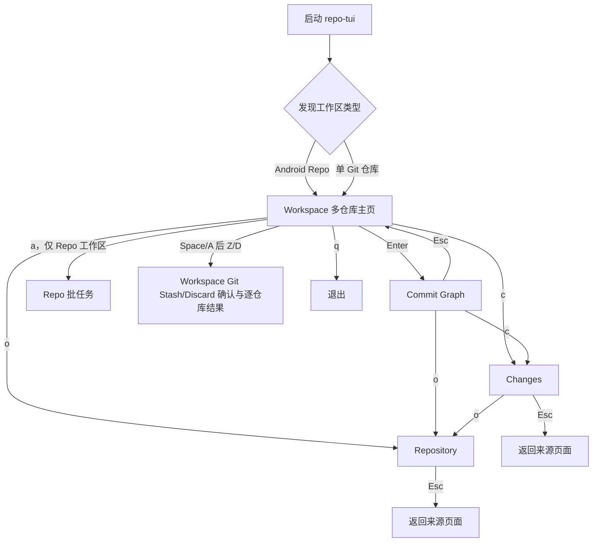
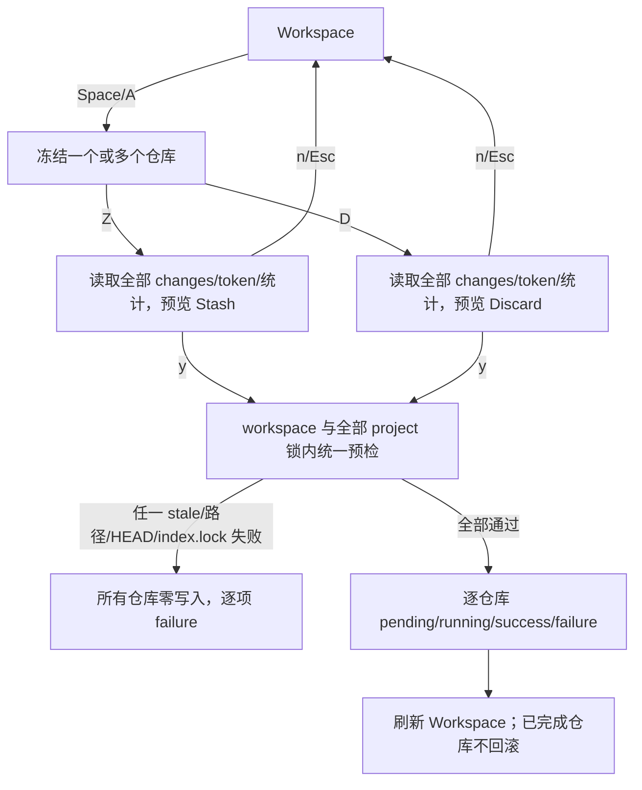
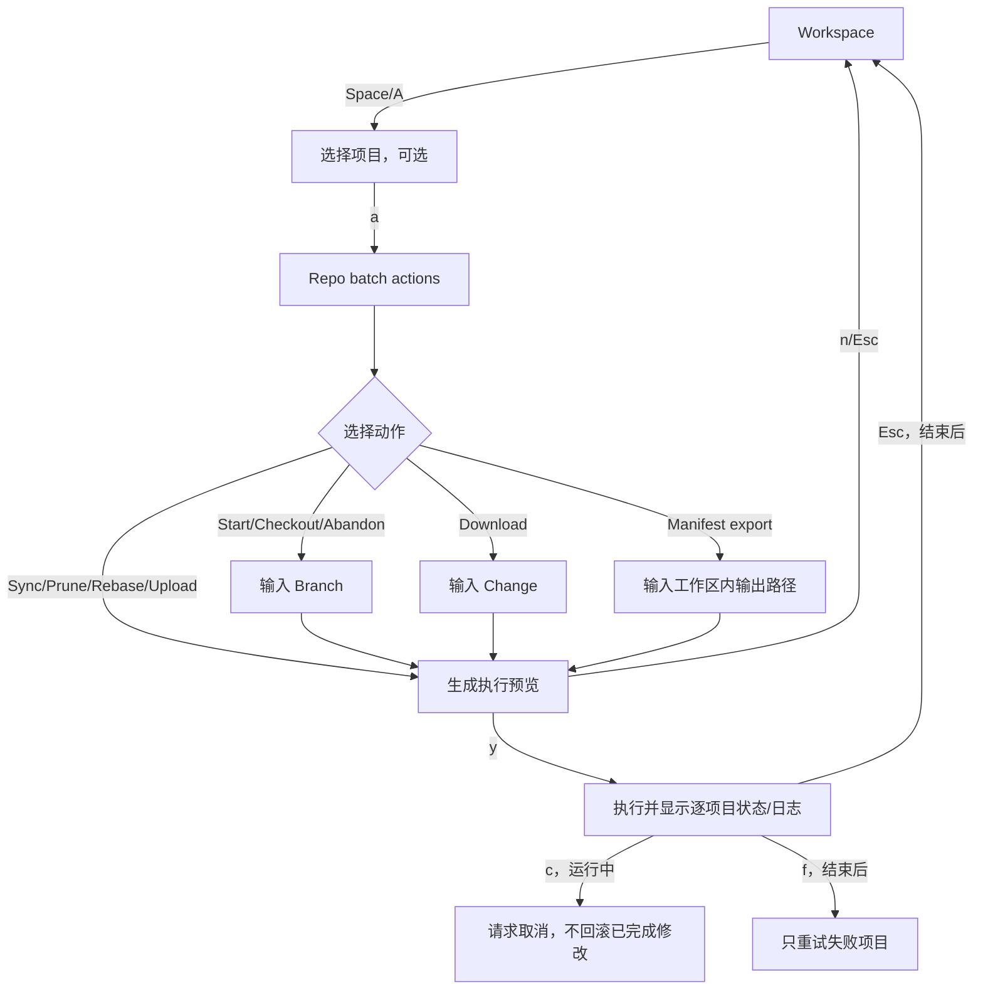
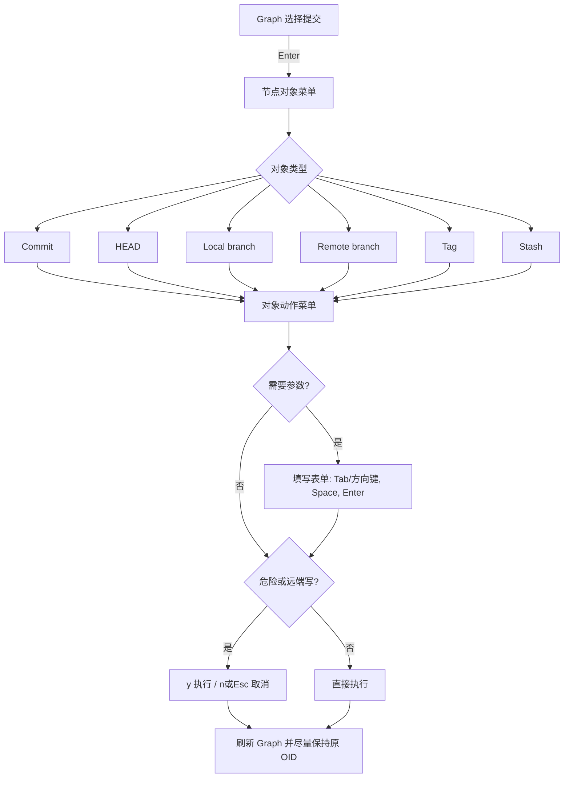
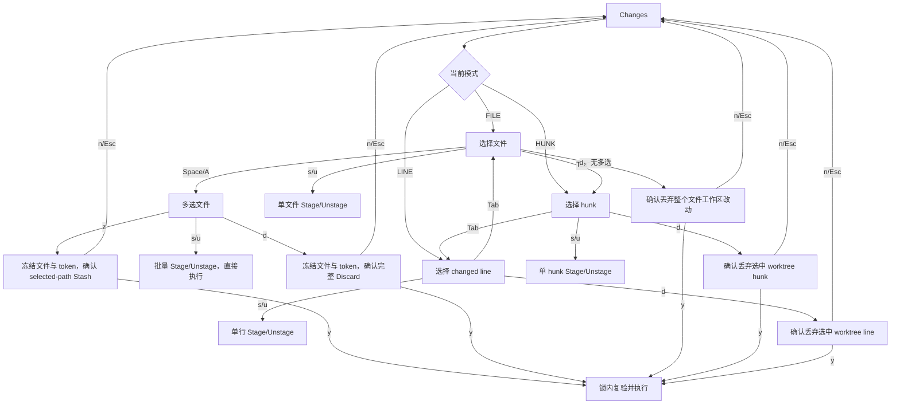
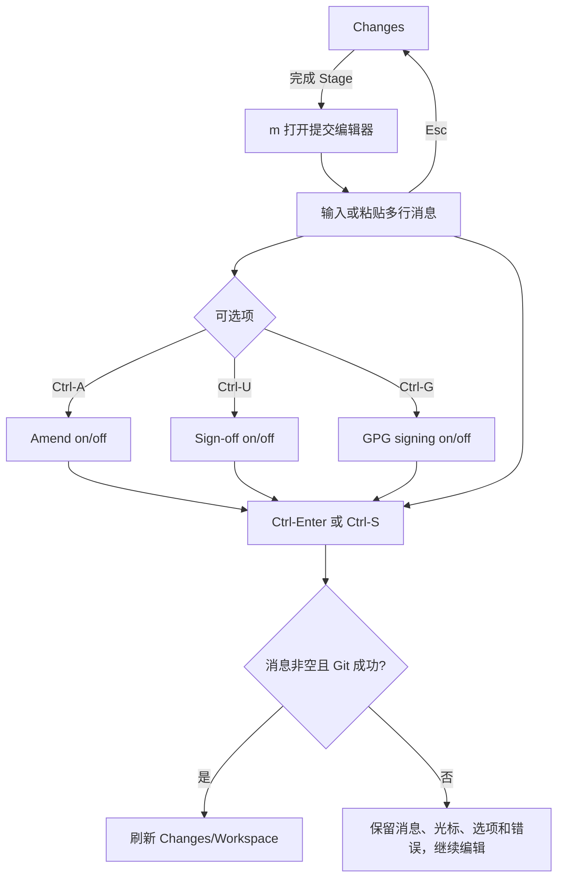
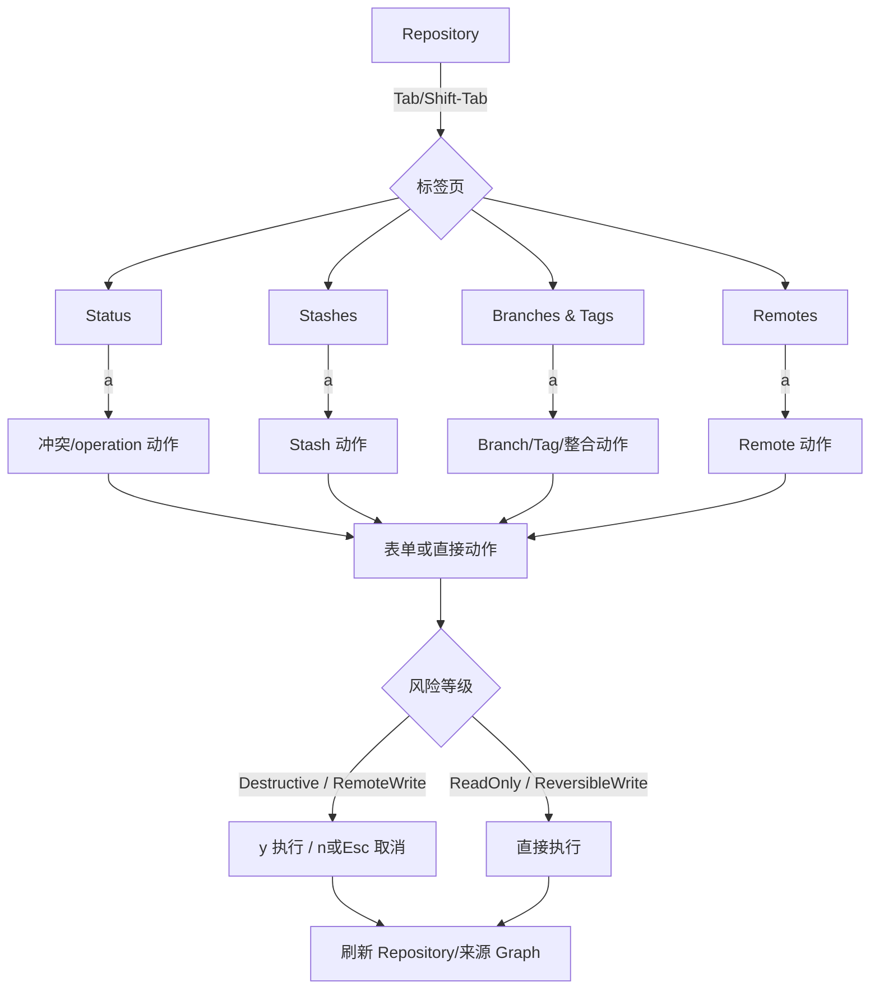

# repo-tui 用户指南与操作流程

本文只描述当前版本中已经实现、可以通过键盘到达的操作。

## 1. 启动

```bash
cargo run -- /path/to/repo-client
cargo run -- /path/to/git-repository
cargo run -- doctor /path/to/workspace
```

从 Repo 或 Git 工作区的任意子目录启动均可。发现 `.repo` 时进入 Repo 多仓库模式；否则打开所在的单 Git 仓库。

最低终端尺寸：Workspace/Graph 为 60x12，Changes 为 60x14。推荐使用 120x40。

## 2. 最快上手

1. 在 Workspace 用 `j/k` 选择仓库，用 `Space`/`A` 冻结一个或多个仓库。
2. 对所选仓库按 `Z` 批量 Stash，或按 `D` 批量 Discard；检查每仓库统计后按 `y` 确认。
3. 按 `Enter` 查看完整提交图，按 `c` 查看和处理文件改动，按 `o` 管理 stash、分支、标签和远端。
4. 在 Changes 用 `Space`/`A` 多选文件，按 `z/s/u/d` 执行 Stash/Stage/Unstage/Discard；`Tab` 切换 file/hunk/line 单目标作用域。
5. 暂存完成后按 `m` 输入提交信息，按 `Ctrl-Enter` 或 `Ctrl-S` 提交。
6. 需要推送时按 `o`，切换到 Remotes，按 `a` 选择 Push；也可在 Graph 选中本地分支对象后推送。
7. 出现确认框时，仔细检查冻结目标和参数，按 `y` 执行，按 `n` 或 `Esc` 取消。

## 3. 通用交互规则

| 按键 | 作用 |
| --- | --- |
| `j/k` 或方向键 | 移动当前列表、菜单或表单选择 |
| `g/G` 或 `Home/End` | 跳到当前列表首项/末项 |
| `Enter` | 打开、选择、提交表单；提交消息编辑器中插入换行 |
| `Tab` / `Shift-Tab` | 切换页面标签、表单字段或 Changes 作用域 |
| `Space` | 切换选择或表单开关 |
| `Backspace` | 删除表单或搜索框最后一个字符 |
| `Esc` | 逐层关闭表单、菜单和页面；确认框中表示取消 |
| `?` | 打开帮助；再次按 `?` 或 `Esc` 关闭 |
| `r` | 刷新当前页面 |
| `q` | 仅在 Workspace 退出程序 |

表单中的文本直接键入；`Space` 只在当前字段是开关时切换开关。Repository/Graph 的普通单行表单目前不支持左右移动光标，只能在末尾输入或用 `Backspace` 删除。

## 4. 总体页面流程



`Changes` 和 `Repository` 会记住来源页面，因此可从 Workspace 或 Graph 进入并返回原处。

## 5. Workspace 多仓库主页

Workspace 展示仓库状态、HEAD、ahead/behind；宽屏右侧 Inspector 还会展示选中仓库的修改文件树。

### 操作

| 按键 | 操作 |
| --- | --- |
| `j/k` | 选择仓库 |
| `/` | 输入 project name/path 搜索，`Enter` 或 `Esc` 结束输入 |
| `d` | 只显示有改动的仓库/恢复全部 |
| `Space` | 选择或取消当前仓库，供 Workspace Git 和 Repo 批任务使用 |
| `A` | 选择或取消当前过滤结果中的所有仓库 |
| `Z` | Stash 所选仓库的完整 dirty 状态，包含 untracked；必须确认 |
| `D` | 完整 Discard 所选仓库的 tracked index/worktree 与 untracked；必须确认 |
| `Enter` | 打开选中仓库的 Commit Graph |
| `c` | 打开选中仓库的 Changes |
| `o` | 打开选中仓库的 Repository 管理 |
| `a` | 打开 Repo 批任务，仅 Android Repo 工作区有效 |

### Workspace Git 批任务流程



Workspace Git 动作只作用于已选择仓库；空选择不会扩展为整个 Workspace。Stash 保存每个仓库的 staged、unstaged 和 untracked；Discard 恢复 tracked index/worktree 并删除 untracked。跨仓库执行不提供事务性回滚，结果面板会保留每个仓库的真实状态。

### Repo 批任务流程



### Repo 动作矩阵

| 动作 | 选择范围 | 输入 | 实际固定形式 |
| --- | --- | --- | --- |
| Sync | 无选择时整个 Repo；有选择时所选项目 | 无 | `repo sync -c -j8 [-- projects...]` |
| Start | 至少一个项目 | Branch | `repo start -- branch project` |
| Checkout | 至少一个项目 | Branch | `repo checkout -- branch project` |
| Abandon | 至少一个项目 | Branch | `repo abandon -- branch project` |
| Prune | 至少一个项目 | 无 | `repo prune -- project` |
| Rebase | 至少一个项目 | 无 | `repo rebase -- project` |
| Upload | 至少一个项目 | 无 | `repo upload --current-branch --yes -- project` |
| Download | 至少一个项目 | Change，例如 `12345/2` | `repo download -- project change` |
| Export manifest | 整个 Repo 工作区 | 相对输出路径 | `repo manifest -r -o path` |

所有 Repo 批任务都先显示范围、参数和精确命令，再由 `y/n` 确认。Abandon 和 Prune 会用危险颜色标识。运行中按 `c` 只是终止任务，不会回滚已经成功的项目。

## 6. Commit Graph

Graph 加载所有本地分支、远端分支、tag、HEAD 和 stash 的可达历史。

### 浏览与过滤

| 按键 | 操作 |
| --- | --- |
| `j/k`、`g/G` | 浏览提交 |
| `f` | 打开完整过滤表单 |
| `/` | 打开过滤表单并聚焦 Query |
| `x` | 清空全部过滤条件 |
| `r` | 重新加载 all-refs 历史 |
| `Enter` | 打开当前提交节点上的对象菜单 |

过滤字段为 Branch、Query、Author、Since、Until。Branch 匹配本地/远端分支的完整可达历史；Query 匹配 OID、subject、body 和 ref；日期使用 UTC `YYYY-MM-DD`，所有非空条件按 AND 组合。

### 对象操作流程



`Esc` 在 Graph 覆盖层中逐层返回：表单 → 动作菜单 → 对象菜单 → Graph。

### Graph 对象动作矩阵

| 对象 | 可用动作 |
| --- | --- |
| Commit / HEAD | Open Changes、Commit staged changes、Amend current commit、Create stash、Create branch here、Create tag here、Cherry-pick、Revert、Merge、Rebase |
| Local branch | Switch、Push、Force push with lease、Merge、Rebase、Rename、Delete |
| Remote branch | Create local branch、Merge、Rebase、Cherry-pick、Revert |
| Tag | Create branch、Cherry-pick、Revert、Merge、Rebase、Delete tag |
| Stash | Show patch、Apply、Pop、Drop |

注意：

- Graph 的 Commit/Amend 使用当前暂存区和当前 HEAD；选中的历史 commit 只提供操作上下文，并不把提交目标切换到该历史 commit。
- Graph 的 Apply/Pop 默认不恢复 index。需要 `Restore index` 时，从 Repository → Stashes 操作。
- Graph 本地分支的强推始终为 `--force-with-lease`，不提供裸 `--force`。

## 7. Changes 文件改动页

### 作用域与操作流程



### 常用按键

| 按键 | 操作 |
| --- | --- |
| `Tab` | FILE → HUNK → LINE → FILE |
| `j/k`、`g/G` | 在当前作用域移动 |
| `Space` | FILE 模式选择/取消当前文件 |
| `A` | FILE 模式选择/取消全部文件 |
| `z` | Stash 所选文件，包含 selected untracked；冻结范围确认后执行 |
| `s` | Stage 当前作用域；有文件多选时批量 Stage |
| `u` | Unstage 当前作用域；有文件多选时批量 Unstage |
| `d` | 有文件多选时完整 Discard 所选 tracked index/worktree 与 untracked；否则丢弃当前 file/hunk/line；必须确认 |
| `PageUp/PageDown` | 滚动 diff |
| `m` | 打开 Commit 编辑器 |

某个动作不适用于当前来源时会被拒绝，例如 staged hunk 不能再次 Stage，worktree hunk不能 Unstage。二进制文件或没有可选择文本 hunk 的文件不能进入对应细粒度模式。

### Commit/Amend 流程



编辑器支持多行粘贴、方向键、Home/End、Backspace/Delete。普通 `Enter` 只插入换行，不会提交。

## 8. Repository 管理页

从 Workspace、Graph 或 Changes 按 `o` 进入。用 `Tab/Shift-Tab` 切换 Status、Stashes、Branches & Tags、Remotes；用 `j/k` 选择条目；按 `a` 打开当前标签页动作菜单。



### Status

| 动作 | 用途 |
| --- | --- |
| Take ours | 冲突文件采用 ours，需要确认 |
| Take theirs | 冲突文件采用 theirs，需要确认 |
| Mark resolved | `git add` 标记已解决 |
| Continue operation | 继续当前 merge/rebase/cherry-pick/revert |
| Skip commit | 跳过当前提交；merge 不支持 skip |
| Abort operation | 中止当前操作，需要确认 |

没有活动 Git operation 或没有冲突文件时，对应动作会返回错误，不会猜测目标。

### Stashes

| 动作 | 参数/效果 | 确认 |
| --- | --- | --- |
| Show stash patch | Stash selector | 否，只读 |
| Create stash | Message、Include untracked、Keep index、Staged only | 否 |
| Apply stash | Selector、Restore index | 否，保留 stash |
| Pop stash | Selector、Restore index | 是，成功后消费 stash |
| Drop stash | Selector | 是 |
| Create branch from stash | Branch、Selector | 是，创建并切换分支，成功后消费 stash |
| Clear all stashes | 无参数 | 是，显示将删除数量 |

`Staged only` 不能与 `Include untracked` 或 `Keep index` 同时开启，非法组合会在 Git 执行前被拒绝。

### Branches & Tags

| 动作 | 参数 |
| --- | --- |
| Create branch | Name、可选 Start ref |
| Switch branch | Branch |
| Rename branch | Old name、New name |
| Delete branch | Branch、Force 开关；始终需要确认 |
| Create tag | Tag、Target，默认 HEAD |
| Delete tag | Tag，需要确认 |
| Merge ref | Reference |
| Rebase onto ref | Reference |
| Cherry-pick OID | Commit OID |
| Revert OID | Commit OID |

Merge/Rebase/Cherry-pick/Revert 发生冲突后，转到 Status 标签页使用冲突动作及 Continue/Skip/Abort。

### Remotes

| 动作 | 参数/说明 | 确认 |
| --- | --- | --- |
| Add remote | Remote、URL | 否 |
| Set remote URL | Remote、URL | 否 |
| Remove remote | Remote | 是 |
| Fetch remote | Remote、Prune 开关 | 否 |
| Pull branch | Remote、Branch、Rebase 开关 | 否 |
| Push branch | Remote、Branch、Set upstream | 是，远端写 |
| Force push with lease | Remote、Branch、Set upstream | 是，可能改写历史 |
| Set upstream | Branch、Upstream | 否 |
| Prune remote | Remote | 否 |

Push 固定使用 `branch:branch` refspec。Force Push 只使用 `--force-with-lease`；确认框会显示 remote、精确 refspec、本地/远端 OID range、Set upstream 和 lease 状态。

## 9. 确认与失败恢复

- Changes 的 selected-file Stash/Discard、单目标 discard、Repository 的破坏性操作和所有 Push 必须按 `y` 确认。
- Workspace `Z`/`D` 必须展示冻结仓库和每仓库改动统计并确认；所有 Repo 批任务也必须确认。
- `n` 或 `Esc` 取消确认，不执行命令。
- 写操作在执行前重新检查 repository snapshot、project/workspace lock 和 `index.lock`；确认后状态变化会导致 stale/precondition failed，而不是对新状态继续执行。
- Changes 和 Workspace Git 整批操作会在任何写入前完成全部目标预检；任一预检失败时整批零写入。
- 跨仓库执行在预检通过后仍可能部分失败；结果按仓库显示，已完成仓库不回滚。
- 操作成功会刷新相关页面；失败会保留错误信息。Commit 失败还会保留消息、光标和选项。
- Repo 批任务日志最多保留最近 500 行；取消不承诺回滚，可在完成后按 `f` 重试失败项。

## 10. 当前尚未支持

- 任意 Git/Repo 命令面板。
- 交互式认证、交互式 rebase、外部 editor/mergetool 的 PTY 接管。
- Graph 上 Apply/Pop stash 时选择恢复 index；请改用 Repository → Stashes。
- Repository/Graph 单行表单中的任意位置光标编辑。
